# 実行計画

**作成日**: 2026-05-09T21:00:34+09:00  
**プロジェクト**: 達成感を可視化するアプリケーション（「人をダメにする」ゲーミフィケーション）

---

## 詳細分析サマリー

### 変更影響評価

| 影響領域 | 有無 | 内容 |
|---|---|---|
| ユーザー向け変更 | Yes | ダッシュボード・AIチャット・データソース連携・ゲーミフィケーション全て新規 |
| 構造的変更 | Yes | 新規フルスタック（フロントエンド・バックエンド・AI層・インフラ） |
| データモデル変更 | Yes | チェックポイント・ポイント履歴・ユーザー・データソース連携モデル |
| API変更 | Yes | 新規REST API全体（チェックポイント・ポイント・AIチャット・連携管理） |
| NFR影響 | Yes | Security Baseline・PBT・ローカルLLMハイブリッド・スケーラビリティ |

### リスク評価

| 項目 | 評価 |
|---|---|
| リスクレベル | **High** |
| 理由 | 新規複雑システム・AI連携（ローカルLLM+Bedrock）・マルチデータソース・ゲーミフィケーションロジック |
| ロールバック複雑度 | Moderate（Greenfield のため既存影響なし） |
| テスト複雑度 | Complex（AI生成ロジック・外部API連携・PBT適用） |

---

## ワークフロー可視化

```mermaid
flowchart TD
    Start(["User Request"])

    subgraph INCEPTION["🔵 INCEPTION PHASE"]
        WD["Workspace Detection\nCOMPLETED"]
        RA["Requirements Analysis\nCOMPLETED"]
        US["User Stories\nCOMPLETED"]
        WP["Workflow Planning\nIN PROGRESS"]
        AD["Application Design\nEXECUTE"]
        UG["Units Generation\nEXECUTE"]
    end

    subgraph CONSTRUCTION["🟢 CONSTRUCTION PHASE"]
        FD["Functional Design\nEXECUTE"]
        NFRA["NFR Requirements\nEXECUTE"]
        NFRD["NFR Design\nEXECUTE"]
        ID["Infrastructure Design\nEXECUTE"]
        CG["Code Generation\nEXECUTE"]
        BT["Build and Test\nEXECUTE"]
    end

    subgraph OPERATIONS["🟡 OPERATIONS PHASE"]
        OPS["Operations\nPLACEHOLDER"]
    end

    Start --> WD --> RA --> US --> WP
    WP --> AD --> UG
    UG --> FD --> NFRA --> NFRD --> ID --> CG
    CG -.->|Next Unit| FD
    CG --> BT --> OPS --> End(["Complete"])

    style WD fill:#4CAF50,stroke:#1B5E20,stroke-width:3px,color:#fff
    style RA fill:#4CAF50,stroke:#1B5E20,stroke-width:3px,color:#fff
    style US fill:#4CAF50,stroke:#1B5E20,stroke-width:3px,color:#fff
    style WP fill:#4CAF50,stroke:#1B5E20,stroke-width:3px,color:#fff
    style AD fill:#FFA726,stroke:#E65100,stroke-width:3px,stroke-dasharray:5 5,color:#000
    style UG fill:#FFA726,stroke:#E65100,stroke-width:3px,stroke-dasharray:5 5,color:#000
    style FD fill:#FFA726,stroke:#E65100,stroke-width:3px,stroke-dasharray:5 5,color:#000
    style NFRA fill:#FFA726,stroke:#E65100,stroke-width:3px,stroke-dasharray:5 5,color:#000
    style NFRD fill:#FFA726,stroke:#E65100,stroke-width:3px,stroke-dasharray:5 5,color:#000
    style ID fill:#FFA726,stroke:#E65100,stroke-width:3px,stroke-dasharray:5 5,color:#000
    style CG fill:#4CAF50,stroke:#1B5E20,stroke-width:3px,color:#fff
    style BT fill:#4CAF50,stroke:#1B5E20,stroke-width:3px,color:#fff
    style OPS fill:#BDBDBD,stroke:#424242,stroke-width:2px,stroke-dasharray:5 5,color:#000
    style Start fill:#CE93D8,stroke:#6A1B9A,stroke-width:3px,color:#000
    style End fill:#CE93D8,stroke:#6A1B9A,stroke-width:3px,color:#000
    style INCEPTION fill:#BBDEFB,stroke:#1565C0,stroke-width:3px,color:#000
    style CONSTRUCTION fill:#C8E6C9,stroke:#2E7D32,stroke-width:3px,color:#000
    style OPERATIONS fill:#FFF59D,stroke:#F57F17,stroke-width:3px,color:#000
    linkStyle default stroke:#333,stroke-width:2px
```



**テキスト代替表現**:
```
INCEPTION PHASE:
  [完了] Workspace Detection
  [完了] Requirements Analysis
  [完了] User Stories
  [進行中] Workflow Planning
  [実行] Application Design
  [実行] Units Generation

CONSTRUCTION PHASE (ユニットごとに繰り返し):
  [実行] Functional Design
  [実行] NFR Requirements
  [実行] NFR Design
  [実行] Infrastructure Design
  [実行] Code Generation

  [実行] Build and Test

OPERATIONS PHASE:
  [予定] Operations (Placeholder)
```

---

## 実行フェーズ詳細

### 🔵 INCEPTION PHASE

| ステージ | 判定 | 理由 |
|---|---|---|
| Workspace Detection | ✅ COMPLETED | 完了済み |
| Reverse Engineering | ⏭ SKIPPED | Greenfield のため不要 |
| Requirements Analysis | ✅ COMPLETED | 完了済み |
| User Stories | ✅ COMPLETED | 完了済み |
| Workflow Planning | 🔄 IN PROGRESS | 現在実行中 |
| **Application Design** | **▶ EXECUTE** | 新規コンポーネント多数（フロントエンド・バックエンド・AI層・データソース連携）。サービス層・コンポーネント依存関係の設計が必要 |
| **Units Generation** | **▶ EXECUTE** | フロントエンド・バックエンドAPI・AI/LLM層・データソース連携・インフラの複数ユニットへの分解が必要 |

### 🚦 INCEPTION → CONSTRUCTION 移行ゲート（必須）

**INCEPTION PHASEの全ステージ完了後、CONSTRUCTION PHASEへ進む前に必ず明示的な承認を取得する。**

```
⛔ STOP: CONSTRUCTION PHASEへの移行には明示的な承認が必要です

INCEPTION PHASEで生成した以下の成果物を確認してください：
- aidlc-docs/inception/plans/execution-plan.md
- aidlc-docs/inception/application-design/（Application Design成果物）
- aidlc-docs/inception/units/（Units Generation成果物）

確認後、「CONSTRUCTION PHASEへ進む」と明示的に承認してください。
承認なしにCONSTRUCTION PHASEへは進みません。
```

---

### 🟢 CONSTRUCTION PHASE（ユニットごとに実行）

| ステージ | 判定 | 理由 |
|---|---|---|
| **Functional Design** | **▶ EXECUTE** | チェックポイント生成ロジック・ポイント計算・達成判定・AIチャットフローの複雑なビジネスロジック |
| **NFR Requirements** | **▶ EXECUTE** | Security Baseline（有効・ブロッキング）・PBT（有効・ブロッキング）・ローカルLLMハイブリッド戦略 |
| **NFR Design** | **▶ EXECUTE** | NFR要件あり。セキュリティパターン・PBTパターン・LLM抽象レイヤーの設計が必要 |
| **Infrastructure Design** | **▶ EXECUTE** | AWSサーバーレス（API Gateway・Lambda・DynamoDB）・Ollama Docker・LocalStack・将来のIoT Core設計 |
| **Code Generation** | **▶ EXECUTE** | 常に実行（ALWAYS） |
| **Build and Test** | **▶ EXECUTE** | 常に実行（ALWAYS） |

### 🟡 OPERATIONS PHASE

| ステージ | 判定 | 理由 |
|---|---|---|
| Operations | ⏸ PLACEHOLDER | 将来の展開・監視ワークフロー用 |

---

## 想定ユニット構成（Units Generation で確定）

| ユニット候補 | 内容 |
|---|---|
| Unit 1: フロントエンド | Webアプリ（ダッシュボード・AIチャット・データソース連携設定） |
| Unit 2: バックエンドAPI | REST API（チェックポイント・ポイント・ユーザー管理） |
| Unit 3: AI/LLM層 | チェックポイント生成・AIチャット応答（ローカルLLM+Bedrock） |
| Unit 4: データソース連携 | GitHub・Google Calendar・Slack・Google Meet の連携処理 |
| Unit 5: インフラ | AWS CDK/SAM・Docker Compose・LocalStack |

---

## 成功基準

- **主目標**: Phase 1 Webアプリの完全動作（チェックポイント自動生成・ポイント蓄積・ダッシュボード）
- **主要成果物**: フロントエンド・バックエンドAPI・AI層・データソース連携・インフラコード・テスト
- **品質ゲート**: Security Baseline準拠・PBT適用・Docker環境での動作確認
